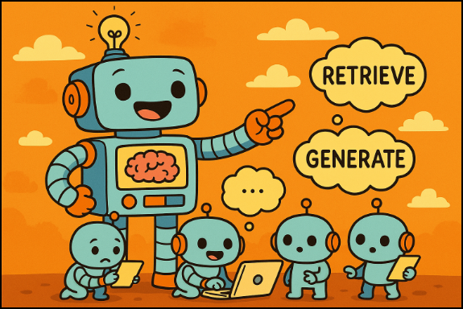
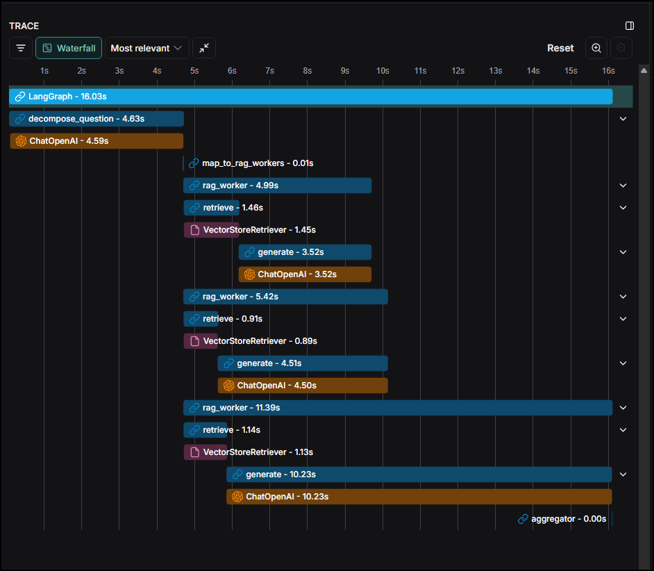

## Dynamic Agentic RAG Workflow

  

This project demonstrates an advanced agentic workflow designed to handle complex queries with high efficiency. The system decomposes a primary question into multiple sub-questions.  The workflow then dynamically generates/spawns a team of Retrieval-Augmented Generation (RAG) worker agents to answer each sub-question in parallel, and finally aggregates their outputs into a single, comprehensive response.

This parallel processing architecture is designed to maximize speed and effectively handle complex queries by breaking them down into smaller, manageable components—making it well-suited for retrieval-augmented generation (RAG) workflows that demand both efficiency and analytical depth.

Workflow Architecture
The core architecture of the workflow is illustrated below. It showcases the process from the initial question decomposition to the final aggregation of parallel-processed results.

  

### The key stages of the workflow are:
1. **Decompose Question:** An initial node analyzes the user's query and breaks it down into distinct sub-questions. In the prompt, a maximum of 8 sub-questions is allowed to ensure focused processing and prevent resource overuse during parallel execution.

2. **Dynamic RAG Workers:** For each sub-question, a dedicated RAG worker is created. Each worker operates independently and in parallel, performing two main steps:
- **Retrieve:** Fetches relevant information from a knowledge base or vector store.
- **Generate:** Synthesises a precise answer based on the retrieved context.

A check was added in this step to limit the worker nodes to a maximum of 8. 

3. **Aggregator:** A final node collects the outputs from all RAG workers and compiles them into a single, coherent and unified answer.

### Evidence of Parallel Execution
A key feature of this architecture is its ability to execute the RAG worker nodes concurrently. The following LangSmith trace provides a clear visualisation of this parallel execution, showing how multiple rag_worker tasks run simultaneously to reduce the overall response time.

  

As shown in the langsmith trace, after the initial decompose_question step, three rag_worker instances are initiated and run at the same time, showing the parallel execution.

### Implementation Details
The complete implementation of this dynamic agentic workflow is available in the provided Jupyter Notebook: workflow_agent_dynamic_parallel.ipynb. This workflow is built using LangGraph, a powerful library for creating stateful, multi-agent applications.